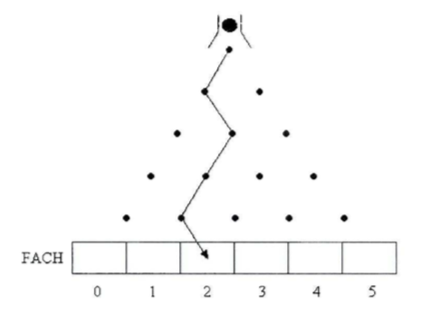

# 13 Aufgabe 13
## 13.1 Galtonsches Brett
Das galtonsche Brett besteht aus einer vertikalen Fläche mit Nägeln.
Durch diese Nägel werden herunterfallende Kugeln abgelenkt. Die Nägel sind in 5 horizontalen Reihen angeordnet,
sodass eine fallende Kugel bei jeder Reihe zufällig nach links oder rechts abgelenkt wird,
bis sie nach der letzten Reihe in ein Fach fällt.

Ihre Aufgabe: Schreiben Sie ein Programm (ohne Grafik), das berechnet in welches Fach eine Kugel nach einem Durchgang
geleitet wird. Das Programm soll automatisch 100 Kugeln berechnen und am Schluss die Anzahl Kugeln pro Fach anzeigen.
Die Fächer sollen als Array implementiert werden.

Zeichnen Sie zuerst ein Struktogramm des Programms.

Tipp: Durch die Anzahl Rechtsablenkungen können Sie erkennen, in welches Fach die Kugel geleitet wird. Verwenden Sie
Schleifen und Abfragen.

Das Ziel: Kleine Applikationen entwickeln lernen. 

## 13.2 Fakultät
Die Fakultätsfunktion n! ist das Produkt aller natürlichen Zahlen von 1 bis n.
`n! = n · (n − 1) · (n − 2) · (n − 3) · . . . · 2 · 1`

Ergänzend definiert man: 0! = 1

Ihre Aufgabe: Schreiben Sie ein Programm, welches die Fakultätsfunktion implementiert. Die Berechnung muss in eine
Funktion ausgelagert werden.

Das Ziel: Kleine Algorithmen entwickeln lernen.

[Hier geht es weiter mit Kapitel 14.]([Struktogramm]https://github.com/streusselhirni/hfict-he17-oop1-aufgaben/tree/master/kapitel14)