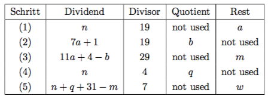

# 14 Aufgabe 14
## 14.1 Zahlen raten

Dem Spieler stehen 6 Versuche zum Erraten einer Zahl zwischen 1 und 100 zur Verfügung.

Ihre Aufgabe: Schreiben Sie ein Programm, welches eine Zufallszahl zwischen 0 und 100 erzeugt.
Der Benutzer soll aufgefordert werden eine Zahl einzugeben. Das Programm muss die eingegebene Zahl
überprüfen. Falls die Zahl grösser oder kleiner ist als die erzeugte Zufallszahl soll der Benutzer über diesen
Zustand informiert werden. Falls die Zahl gefunden wurde soll das Programm beendet werden. Dem Benutzer stehen
maximal 6 Versuche zur Verfügung. Falls die Zahl nicht innerhalb dieser 6 Versuche gefunden wurde, hat der Benutzer
das Spiel verloren.

Es muss die Möglichkeit bestehen das Programm nach einem Durchgang zu widerhohlen oder abzubrechen.

Bildschirmausgabe:
```
Geben Sie die 1. Zahl ein: 50
Die gesuchte Zahl ist kleiner
Geben Sie die 2. Zahl ein: 25
Die gesuchte Zahl ist grösser
Geben Sie die 3. Zahl ein: 35
Die gesuchte Zahl ist grösser
Geben Sie die 4. Zahl ein: 40
Die gesuchte Zahl ist grösser
Geben Sie die 5. Zahl ein: 48
Die gesuchte Zahl ist kleiner
Geben Sie die 6. Zahl ein: 46
Gratulation! Sie haben die Zahl 46 im 6. Versuch erraten.
```

Zeichnen Sie zuerst ein Struktogramm des Programms.

Tipp: Verwenden Sie Schleifen und Abfragen.

Zusatz: Wenn der Benutzer die Zahl sehr früh herausfindet soll ein spezieller Text ausgegeben werden.

Das Ziel: Repetition von Schleifen und Abfragen.

## 14.2 Berechnung des Osterdatums eines Jahres
Das Osterdatum eines Jahres ist astronomisch wie folgt definiert:

Wenn d das erste Vollmond-Datum nach oder am 21. März ist, dann ist Ostern der erste Sonntag nach oder an diesem Tag d.
Es gibt verschiedene Algorithmen zur Berechnung des Osterdatums eines Jahres y. Der folgende von T.H.
O’Beirne funktioniert für alle Jahre y im Bereich:

`1900 <= y <= 2099`

Algorithmus (T.H. O’Beirne)

1. Setzen Sie n=y−1900
2. Führen Sie die folgenden 5 ganzzahligen Divisionen mit Rest durch (Tipp: Modulo Operator % ):

3. Setzen Sie k=25−m−w
4. Es gilt: Osterdatum = k-ter April. Dabei kann k auch <= 0 sein. Verwenden Sie dazu folgenden Interpredation:
k = 0: 31.März
k = -1: 30.März
k = -2: 29.März
u.s.w.


Ihre Aufgabe: Schreiben Sie ein Programm, welches ein Jahr einliest und das Osterdatum dieses Jahres berechnet und
anzeigt. Die Berechnung muss in einer Funktion erfolgen, welcher Sie das Jahr übergeben.

Tipp: Programmieren Sie Schritt für Schritt nach Vorgabe. Das Ziel: Kleine Algorithmen entwickeln lernen.

Bildschirmausgabe:
```
Berechnen des Osterdatums zwischen 1900 und 2099: Geben Sie das Jahr ein: 2005

Im Jahr 2005 sind die Ostern am 27. Maerz.
```

## 14.3 Zinsberechnung
Es soll ein Zinsberechnungsprogramm für eine Bank entwickelt werden.

Ihre Aufgabe: Schreiben Sie ein Programm, welches folgende Daten vom Benutzer einliest:

* Schuldbetrag (double)
* Zins pro Jahr (double)
* Laufzeit (int)
* Amortisation (Rückzahlung) pro Jahr (double)

Schreiben Sie eine Funktion, welche die vier Werte übernimmt und dem Bankangestellten die Einnahmen zurück gibt.
Geben Sie den Gewinn für die Bank und den totalen Rückzahlungsbetrag für den Bankkunden in der main-Funktion aus.
In der Funktion muss der Schuldbetrag für das abgelaufene Jahr und der daraus resultierende Zinsbetrag ausgegeben werden.

Bildschirmausgabe:
```
Kreditbetrag in SFr: 200 Laufzeit in Jahren: 8
Zins pro Jahr in %: 12 Rückzahlung pro Jahr in SFr: 10
Schuldbetrag 1. Jahr: 200 SFr. Ergibt: 24.00 SFr Zins
Schuldbetrag 2. Jahr: 190 SFr. Ergibt: 22.80 SFr Zins
...
Schuldbetrag 7. Jahr: 140 SFr. Ergibt: 16.80 SFr Zins
Schuldbetrag 8. Jahr: 130 SFr. Ergibt: 15.60 SFr Zins
Der totale Zins über die gesamte Laufzeit beträgt: 158.4
Der totale Rückzahlungsbetrag des Kunden beträgt: 358.4
```
Tipp: Entwickeln Sie den Algorithmus bevor Sie mit der Programmierung beginnen.

Das Ziel: Programme nach einer Beschreibung entwickeln lernen.

## 14.4 Zinsberechnung mit einem Zeiger auf einen Array
Schreiben Sie das Zinsberechnungsprogramm so um, dass statt den einzelnen Variablen ein Array (double) mit drei
Feldern verwendet wird.

Nehmen Sie folgende änderungen vor:
1. übergeben Sie der Funktion den Array (Schuldbetrag, Zins, Amortisation)
2. übergeben Sie der Funktion die Laufzeit (call by Referenz) des Vertrages

Das Ziel: Den Umgang mit Arrays und Funktionen kennen lernen. Referenzen als Funkti- onsparameter kennen lernen.

[Hier geht es weiter mit Kapitel 15.](https://github.com/streusselhirni/hfict-he17-oop1-aufgaben/tree/master/kapitel15)
